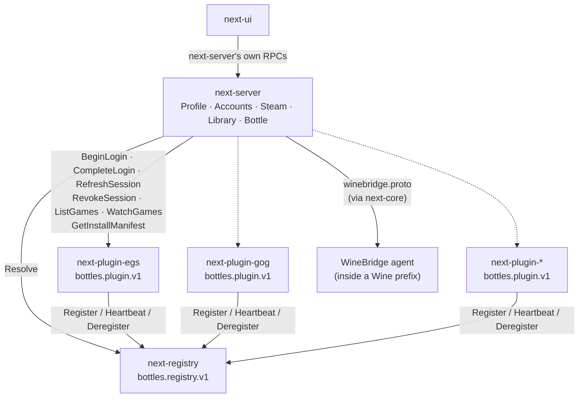

# next-proto

Generated protobuf/gRPC bindings shared across the Bottles Next workspace.
Types are generated at build time via `tonic-prost-build` (see `build.rs`)
and re-exported under `next_proto::bottles::<package>::v1` (plus
`next_proto::winebridge` for the WineBridge protocol).

## Protocol architecture

Bottles Next is split into several processes that talk to each other over
these protocols:

- **`bottles.registry.v1` (Registry)** — a small standalone process
  (`next-registry`) that lets out-of-process storefront plugins announce
  themselves and lets `next-server` resolve which endpoint owns a given
  `Storefront` at runtime. Exactly one plugin may own a given storefront at
  a time.

- **`bottles.plugin.v1` (Plugin)** — the storefront-agnostic contract every
  storefront plugin process (`next-plugin-egs`, `next-plugin-gog`, ...)
  implements: interactive login, session refresh/revoke, and the
  storefront's game catalog/install manifest. Adding a new storefront never
  requires changing this file — everything storefront-specific is expressed
  through oneofs (`LoginChallenge`, etc).

- **`bottles.profiles.v1` (Profile)**, **`bottles.accounts.v1` (Accounts)**,
  **`bottles.steam.v1` (Steam)**, **`bottles.library.v1` (Library)**, and
  **`bottles.bottle.v1` (Bottle)** — hosted by `next-server`, the
  process `next-ui` talks to directly. Each is a thin gRPC facade over a
  `next-core` manager, plus whatever Registry/Plugin dialing that manager
  deliberately doesn't own:
  - `Profile` owns profile CRUD, the active-profile pointer, and
    `WatchActiveProfile`. It does not touch storefront credentials.
  - `Accounts` owns linking/unlinking/refreshing storefront accounts
    (`ActivateAccounts`), dialing `Plugin` through `Registry` as needed.
  - `Steam` is separate from `Plugin` because Steam sessions are read
    directly off the local `loginusers.vdf`, not through an out-of-process
    plugin.
  - `Library` aggregates each linked storefront's `Plugin.ListGames`/
    `WatchGames` into one merged view, and drives installs via
    `Plugin.GetInstallManifest`.
  - `Bottle` is next-core's Wine-prefix lifecycle/configuration surface.

- **`bottles.common.v1` (common)** — shared value types (`Storefront`,
  `LinkedAccount`, `Game`, `InstallState`) referenced across the other
  `bottles.*` packages; not a service of its own.

- **`winebridge`** (top-level `proto/winebridge.proto`, not under
  `bottles.*`) — used by `next-core` to talk to the WineBridge agent running
  inside a Wine prefix (registry, processes, services, DLL overrides,
  filesystem). Unrelated to the `bottles.*` packages above: it's an
  in-prefix control channel, not part of the storefront/profile/library
  surface.

## Adding a new `.proto` file

Register it in `build.rs`'s `compile_protos` call — the module path under
`next_proto::bottles` mirrors the proto package (e.g.
`bottles.accounts.v1` → `next_proto::bottles::accounts::v1`).
